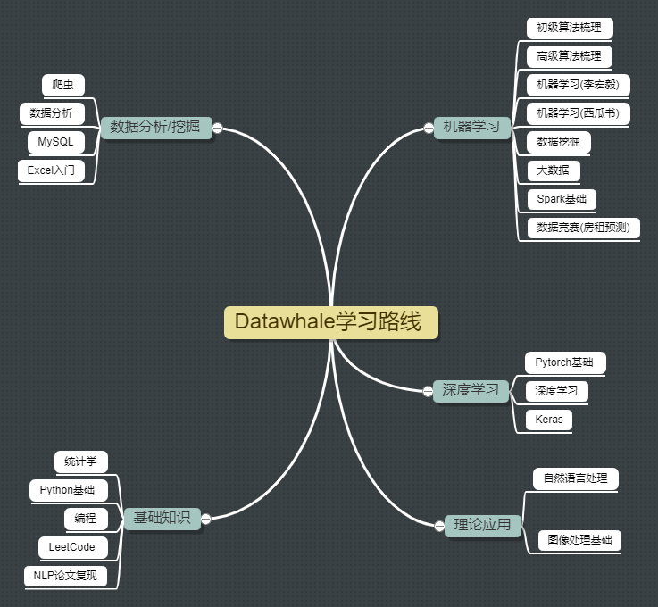

Datawhale_Learning涵盖了AI领域从理论知识到动手实践的学习内容

# 编程基础
## 课程列表
### 【编程】
**课程简介**

课程设计：光城 、LeoLRH

组队学习说明：利用自己所熟知的编程语言，具有一定基础，讨论在面试中可能出现的数据结构问题，一起学习重温经典数据结构

任务路线：数组->链表->栈->队列->递归->排序->二分查找->哈希表->字符串->二叉树->堆->图->回溯->分治->动态规划

组队学习周期：14天甚至往上大概16天左右（周末进行整体整理讨论）（每天任务时间具体看任务情况）

定位人群：有一门语言基础和算法基础的同学，
每个任务完成大概所需时间：平均每天学习时间在1个小时左右，晚上统一，半个小时进行集体讨论总结打卡。

难度系数：高，小白慎入！！！

**任务安排**
- Task1：[数组+链表(2天)](./编程基础/Programming/学习任务/Task1.md)
- Task2：[栈+队列+递归(3天)](./编程基础/Programming/学习任务/Task2.md)
- Task3：[排序+二分查找(2天)](./编程基础/Programming/学习任务/Task3.md)
- Task4：[散列表（哈希表）+字符串(2天)](./编程基础/Programming/学习任务/Task4.md)
- Task5：[二叉树+堆(2天)](./编程基础/Programming/学习任务/Task5.md)
- Task6：[图(2天)](./编程基础/Programming/学习任务/Task6.md)
- Task7：[递归+回溯+分治+动态规划(2天)](./编程基础/Programming/学习任务/Task7.md)

### 【leetCode】
**任务安排**
- Task1：
- Task2：
- Task3：
- Task4：
- Task5：
- Task6：
- Task7：
- Task8：
- Task9：
- Task10：

# 基础知识

## 课程列表
### 【统计学】

**课程简介**

课程设计：王佳鑫、许辉

组队学习说明：学习内容涵盖统计学中所有的主要知识，并对其分部分进行梳理总结。

任务路线：根据所学习内容进行（1）统计学基本知识、二项及泊松分布、大数定律、正态分布等内容的总结进行整体的回顾、梳理与完善；（2）中心极限定理、置信区间、 假设检验等内容的总结进行整体的回顾、梳理与完善。

组队学习周期：7天

定位人群：微积分、基本概率知识储备，难度系数中

每个任务完成大概所需时间：2-3h

学习内容

（1）本次统计学学习以网易云可汗学院公开课为主：

视频链接：http://open.163.com/special/Khan/khstatistics.html

（2）并以《深入浅出统计学》为辅：

书籍链接：https://pan.baidu.com/s/1dCV6rrOWZU-deKxAoectGA

**任务安排**

- Task1：[统计学基本知识+二项及泊松分布+大数定律+正态分布(2天)](./基础知识/Statistical/学习任务/Task1.md)
- Task2：[中心极限定理+置信区间(1天)](./基础知识/Statistical/学习任务/Task2.md)
- Task3：[假设检验(2天)](./基础知识/Statistical/学习任务/Task3.md)
- Task4：[线性回归+卡方分布+方差分析(2天)](./基础知识/Statistical/学习任务/Task4.md)

### 【Python基础】
**课程简介**

课程设计：马晶敏，叶梁

组队学习说明：学习python基础知识，针对python小白的学习之路

任务路线：基础知识-函数-第三方模块-类和对象

组队学习周期：10天

定位人群：python小白，难度系数低

每个任务完成大概所需时间：每天平均花费时间2小时-4小时不等，根据个人学习接受能力强弱有所浮动

**任务安排**
- Task1：[环境搭建+python初体验+python基础讲解+ python数值基本知识(2天)](./基础知识/Python/学习任务/Task1.md)
- Task2：[列表+元组+string字符串+字符串格式化问题(2天)](./基础知识/Python/学习任务/Task2.md)
- Task3：[数组+集合+判断语句+三目表达式+循环语句(2天)](./基础知识/Python/学习任务/Task3.md)
- Task4：[数组+集合+判断语句+三目表达式+循环语句(2天)](./基础知识/Python/学习任务/Task4.md)
- Task5：[函数+file+os模块+ datetime模块(2天)](./基础知识/Python/学习任务/Task5.md)

# 数据科学
## 课程列表
### 【Excel入门】
**课程简介**

课程设计：杨煜，李严

组队学习说明：职场人士必备学习内容。通过集中式学习和大量实战练习，快速了解并掌握Excel核心功能，保证今后工作中用得到。

任务路线：基础界面(2天) --> 基础文件操作&单元格操作(2天) --> 基础函数(2天) --> 查找函数vlookup和 match/index(2天) --> 基础图表(3天) --> 数据透视表(2天)

组队学习周期：11天

定位人群：小白或有一点基础但不熟练的人群；初入职场人群必学；难度系数简单

每个任务完成大概所需时间：2-3h/每天

**任务安排**

- Task1：[基础界面+文件操作+基础单元格操作(3天)](数据科学/Excel/学习任务/Task1.md)
- Task2：[单元格引用+运算符+文本函数+逻辑函数+计算函数(2天)](数据科学/Excel/学习任务/Task2.md)
- Task3：[vlookup函数用法+match&index+双条件查找(2天)](数据科学/Excel/学习任务/Task3.md)
- Task4：[图表类型+图表类型选择指南+图表的构成要素(3天)](数据科学/Excel/学习任务/Task4.md)
- Task5：[数据透视表+实现数据分段统计+变更值汇总依据+设置三种值百分比+计算字段&计算项(2天)](数据科学/Excel/学习任务/Task5.md)

### 【数据分析】

**课程简介**

课程设计：金娟娟

组队学习说明：学习python for data analysis基础知识

任务路线：python基础-重要的python库（numpy/pandas/matplotlib/seaborn等)-数据清洗和分析

组队学习周期：15天定位人群：数据分析小白，难度系数低

每个任务完成大概所需时间：每天平均花费时间2小时-4小时不等，根据个人学习接受能力强弱有所浮动

**任务安排**
- Task0：[github+jupyter(1天)](数据科学/Data_Analysis/学习任务/Task0.md)
- Task1：[第4章numpy+作业1(2天)](数据科学/Data_Analysis/学习任务/Task1.md)
- Task2：[第5章pandas+第6章数据载入(3天)](数据科学/Data_Analysis/学习任务/Task2.md)
- Task3：[第7章数据清洗+第8章数据联合(3天)](数据科学/Data_Analysis/学习任务/Task3.md)
- Task4：[第10章数据聚合+第12章高阶pandas+作业2(3天)](数据科学/Data_Analysis/学习任务/Task4.md)
- Task5：[第9章matplotlib+作业3(2天)](数据科学/Data_Analysis/学习任务/Task5.md)
- Task6：[第11章时间序列(2天)](数据科学/Data_Analysis/学习任务/Task6.md)
- Task7：[大作业+总结(3天)](数据科学/Data_Analysis/学习任务/Task7.md)

### 【MySQL】

**课程简介**
课程设计：杨皓博 孙涛 杨煜

组队学习说明：一周内快速了解并掌握MySQL的主要内容。通过大量SQL语句的实战练习，可以在简历上写熟练掌握MySQL。(注意：本课程只关注SQL查询语句本身，对数据库的涉及较少。)

任务路线： MySQL软件安装及数据库基础->查询语句->表操作->表联结->MySQL 实战->MySQL 实战-复杂项目

组队学习周期：（8天）

**定位人群：小白，难度系数小**

每个任务完成大概所需时间：2-3h
数据科学/MYSQL/MySQL学习内容/MySQL任务1 - 3天.md
**任务安排**
- Task1：[软件安装及数据库基础+MySQL 基础 （一）- 查询语句(3天)](数据科学/MYSQL/学习任务/Task1.md)
- Task2：[MySQL 基础 （二）- 表操作(3天)](数据科学/MYSQL/学习任务/Task2.md)
- Task3：[MySQL 实战(1天)](数据科学/MYSQL/学习任务/Task3.md)
- Task4：[MySQL 实战 - 复杂项目(1天)](数据科学/MYSQL/学习任务/Task4.md)

### 【爬虫】

**课程简介**

课程设计：光城、李方

组队学习说明：从零基础到能独立完成一个简易的爬虫项目

任务路线：请求→re→beautifulsoup→lxml→selenium→IP问题→实战小项目

组队学习周期：7天

定位人群：有Python基础。难度系数中

每个任务完成大概所需时间：2-3h/天

**任务安排**
- Task1：[get与post请求+正则表达式(2天)](./数据科学/Scrapy/学习任务/Task1.md)
- Task2：[beautifulsoup+xpath(2天)](./数据科学/Scrapy/学习任务/Task2.md)
- Task3：[selenium+IP(2天)](./数据科学/Scrapy/学习任务/Task3.md)
- Task4：[实战大项目(2天)](./数据科学/Scrapy/学习任务/Task4.md)
# 机器学习
## 课程列表
### 【初级算法梳理】

**课程简介**

课程设计：苏静、康兵兵

组队学习说明：通过查阅书籍或参考文献、学习视频等，对传统机器学习算法进行梳理

任务路线：线性回归--->逻辑回归--->决策树

组队学习周期：7天

定位人群：有概率论、矩阵运算、求导、泰勒展开等基础数学知识

难度系数：低

每个任务完成大概所需时间：2-3h

**任务安排**
- Task1：[线性回归算法梳理(2天)](./机器学习/Primary-algorithm-combing/学习任务/Task1.md)
- Task2：[逻辑回归算法梳理(2天)](./机器学习/Primary-algorithm-combing/学习任务/Task2.md)
- Task3：[决策树算法梳理(2天)](./机器学习/Primary-algorithm-combing/学习任务/Task3.md)

### 【高级算法梳理】 

**课程简介**

课程设计：黑桃，刘广月，于鸿飞

组队学习说明：通过查阅相关文献，对机器学习算法进行梳理

任务路线：RF--->GBDT--->XGB--->LightGBM

组队学习周期：10天

定位人群：有概率论、矩阵运算、求导、泰勒展开等基础数学知识；

难度系数：中

每个任务完成大概所需时间：2-3h

**任务安排**
- Task1：[随机森林算法梳理(2天)](./机器学习/Advanced-algorithm-combing/学习任务/Task1.md)
- Task2：[GBDT算法梳理(2天)](./机器学习/Advanced-algorithm-combing/学习任务/Task2.md)
- Task3：[XGB算法梳理(3天)](./机器学习/Advanced-algorithm-combing/学习任务/Task3.md)
- Task4：[LightGBM算法梳理(3天)](./机器学习/Advanced-algorithm-combing/学习任务/Task4.md)

### 【李宏毅机器学习】：

**课程简介**

**任务安排**
- Task1：
- Task2：
- Task3：
- Task4：
- Task5：
- Task6：
- Task7：
- Task8：
- Task9：
- Task10：

### 【西瓜书】

**课程简介**

**任务安排**
- Task1：
- Task2：
- Task3：
- Task4：
- Task5：
- Task6：
- Task7：
- Task8：
- Task9：
- Task10：

# 深度学习
## 课程列表
### 【Pytorch基础】

**课程简介**
课程设计：许辉 李奇锋

组队学习说明：通过学习pytorch的基本操作，最终完成手写数字的识别

任务路线：安装pytorch->设立图并计算->实现逻辑回归->构建多层神经网络->PyTorch实现L1，L2正则化以及Dropout->书写优化器代码->用PyTorch完成手写数字识别

学习周期：14天

定位人群：熟悉python的基础用法

任务完成所需时间：2-3h/天

难度系数：中

**任务安排**
- Task1：[PyTorch的基本概念(2天)](深度学习/Pytorch/学习任务/Task1.md)
- Task2：[设立计算图并自动计算(2天)](深度学习/Pytorch/学习任务/Task2.md)
- Task3：[PyTorch实现Logistic regression(2天)](深度学习/Pytorch/学习任务/Task3.md)
- Task4：[PyTorch实现多层网络(2天)](深度学习/Pytorch/学习任务/Task4.md)
- Task5：[PyTorch实现L1，L2正则化以及Dropout(2天)](深度学习/Pytorch/学习任务/Task5.md)
- Task6：[PyTorch理解更多神经网络优化方法(2天)](深度学习/Pytorch/学习任务/Task6.md)
- Task7：[手写数字识别(2天)](深度学习/Pytorch/学习任务/Task7.md)

# 理论应用
## 课程列表
### 【数据挖据】 

**课程简介**

课程设计：范晶晶、李碧涵、

组队学习说明：应用机器学习算法，完整地走完一个数据挖掘项目流程

任务路线：数据分析→特征工程→模型构建→模型评估→模型调优→模型融合

组队学习周期：12天

定位人群：有Python基础，sklearn基础。难度系数中

每个任务完成大概所需时间：2-3h/天

**任务安排**
- Task1：[数据分析(2天)](./理论应用/Data-mining/学习任务/Task1.md)
- Task2：[特征工程(2天)](./理论应用/Data-mining/学习任务/Task2.md)
- Task3：[模型构建 (2天)](./理论应用/Data-mining/学习任务/Task3.md)
- Task4：[模型评估(2天)](./理论应用/Data-mining/学习任务/Task4.md)
- Task5：[模型调优(2天)](./理论应用/Data-mining/学习任务/Task5.md)
- Task6：[模型融合(2天)](./理论应用/Data-mining/学习任务/Task6.md)

### 【自然语言处理(理论+实践)】

**课程简介**

课程设计：jepson

组队学习说明：学习自然语言处理理论，并且通过对某些数据集的文本分类任务不断优化来进行实践。

任务路线：特征提取—>特征选择—>文本表示—>传统机器学习算法跑模型—>LDA生成新特征—>深度学习算法跑模型

定位人群：有Python基础，基本框架的基础（例如TensorFlow、Keras和pyTorch等）！难度系数高

组队学习周期：18天

每个任务完成大概所需时间：3-4h

**任务安排**
- 预备任务：[tensorflow安装+tensrflow基础+NLP](./理论应用/NLP-theory-practice-/学习任务/预备任务.md)
- Task1：[数据集探索(2天)](./理论应用/NLP-theory-practice-/学习任务/Task1.md)
- Task2：[特征提取(2天)](./理论应用/NLP-theory-practice-/学习任务/Task2.md)
- Task3：[特征选择 (2天)](./理论应用/NLP-theory-practice-/学习任务/Task3.md)
- Task4：[模型 (2天)](./理论应用/NLP-theory-practice-/学习任务/Task4.md)
- Task5：[文本表示(2天)](./理论应用/NLP-theory-practice-/学习任务/Task5.md)
- Task6：[神经网络基础(2天)](./理论应用/NLP-theory-practice-/学习任务/Task6.md)
- Task7：[卷积神经网络(2天)](./理论应用/NLP-theory-practice-/学习任务/Task7.md)
- Task8：[循环和递归神经网络(2天)](./理论应用/NLP-theory-practice-/学习任务/Task8.md)
- Task9：[Attention原理(2天)](./理论应用/NLP-theory-practice-/学习任务/Task9.md)
- Task10：[BERT(3天)](./理论应用/NLP-theory-practice-/学习任务/Task10.md)

### 【论文复现】

**课程简介**

【课程简介】

课程设计：杨开漠，王翔

任务路线：论文学习->研读模型->跑模型->针对学习中存在的问题进行后期讨论

学习周期：14天（每周一篇）

定位人群：具有nlp基础、代码阅读能力以及论文学习能力

学习难度：高

【学习模式】

论文发布（第一天或者最后一天晚上） -> 论文研读笔记作业（3天）-> 模型调试心得作业（4天）-> 后期讨论（最后一天晚上）

* 论文研读笔记作业模板
    * 研究动机，研究方法，实验结果，创新点，个人点评

* 模型调试心得作业
    * 模型地址，模型运行环境，数据集选择与下载，模型运行步骤，问题与解决方法汇总，个人点评
    
 ### 【Spark基础】
 
 **课程简介**
 
课程设计：Summer

组队学习说明：学习spark基础知识，针对spark小白的学习之路

任务路线：运行原理-环境搭建-RDD编程-SparkSQL-MLlib-常用算法

组队学习周期：12天

定位人群：spark小白，**难度系数中**

每个任务完成大概所需时间：每天平均花费时间**2小时-4小时**不等，根据个人学习接受能力强弱有所浮动
 
 **任务安排**

 - Task1：[运行原理，RDD设计，DAG，安装与使用(3天)](./机器学习/Spark基础/学习任务/Task1.md)
 - Task2：[RDD编程，熟悉算子，读写文件(3天)](./机器学习/Spark基础/学习任务/Task2.md)
 - Task3：[DataFrame,SparkSQL (2天)](./机器学习/Spark基础/学习任务/Task3.md)
 - Task4：[MLlib流设计，特征工程 (2天)](./机器学习/Spark基础/学习任务/Task4.md)
 - Task5：[逻辑回归，决策树(2天)](./机器学习/Spark基础/学习任务/Task5.md)

